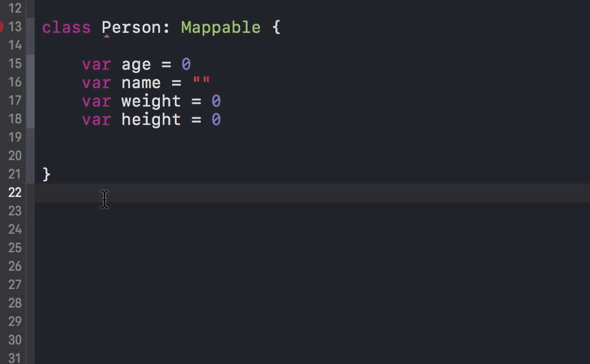
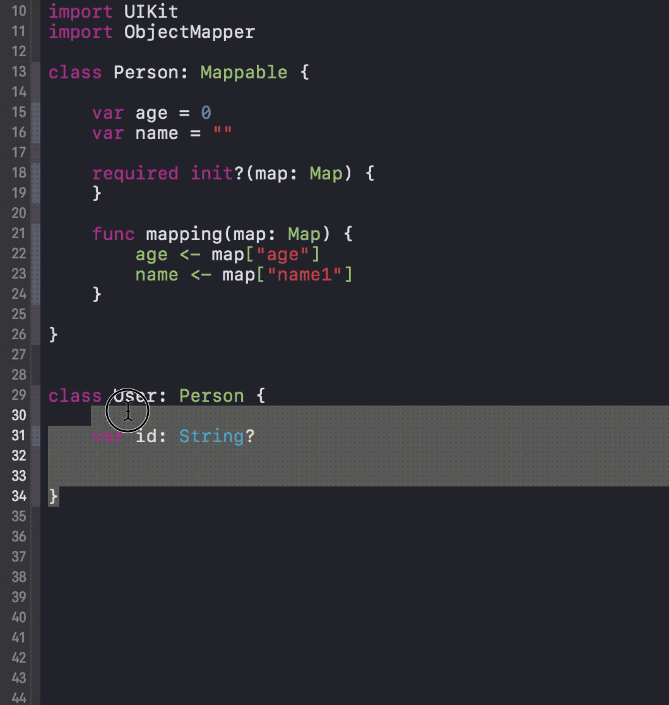
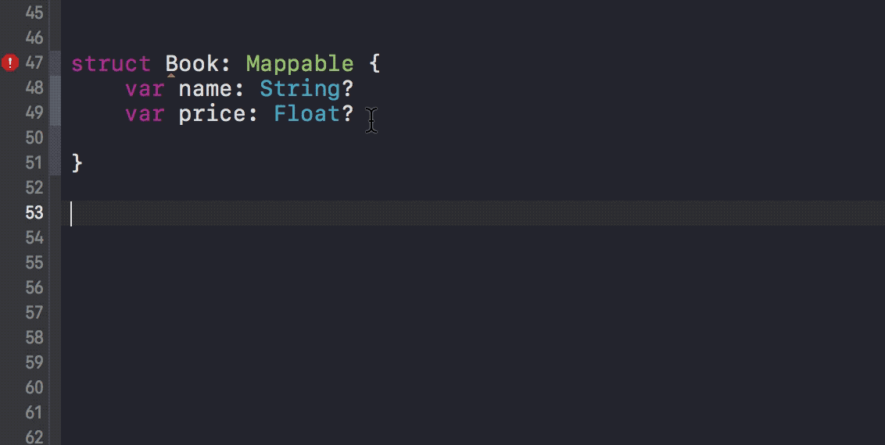

# ObjectMapHelper

If you use [ObjectMapper](https://github.com/Hearst-DD/ObjectMapper), you will need it. Now you can fast create ObjectMapper mapping function.

## Support
**`Xcode 8+`**  **`swift 3`**

## Example
#### class

#### subClass

#### struct

## Install on Xcode 8
1. Download the [ObjectMapHelper.zip](https://github.com/is0bnd/ObjectMapHelper/blob/master/ObjectMapHelper.zip)
2. Open and copy `ObjectMapHelper.app` to `/Applications` folder
3. Run it then close it.

## Usage
### 1. Enable ObjectMapHelper
Check <kbd>System Preferences</kbd> -> <kbd>Extensions</kbd> -> <kbd>Xocde Source Editor</kbd> -> <kbd> ObjectMapHelper </kbd>

### 2. Setting Shortcut in Xocde 
<kbd>Preferences</kbd> -> <kbd>Key bindings</kbd> -> <kbd>Filter: MapHelper</kbd>

## Tips
1. You should selected all of the action class code
2. If you use it in a subclass, you need to write the map function for the first time
3. You can only selected one class everytimes

## Trouble Shooting
* Please install macOS Sierra (version 10.12) if your macOS is 10.11.

## Thanks
Thanks for [Timur Galimov](https://github.com/timaktimak) [*SwitchCaseGenerator*](https://github.com/timaktimak/SwitchCaseGenerator)

